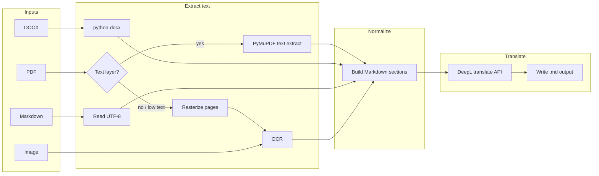

# Plan: Document → Markdown → DeepL Translation Tool (Python)

## Goal

Deliver a **Python CLI** that ingests **PDF** (text or scanned), **DOCX**, **Markdown**, or **raster images**, normalizes content to **Markdown**, then **translates** between **English and Spanish** using the **DeepL API** (free tier). The API key will be supplied later via **`.env`** (`DEEPL_AUTH_KEY`).

## Context & Constraints

| Constraint | Detail |
|-------------|--------|
| Translation | DeepL API Free: **500,000 characters per month** (source text, Unicode code points); text and document usage count together. Plan for optional **usage/quota check** before large batches. |
| Languages | **EN ↔ ES** only for MVP; direction inferred from detected source language or overridden by flags. |
| Batch | Single file, **folder** (non-recursive vs recursive as a flag), and/or **wildcard/glob** pattern. |

## High-Level Pipeline



1. **Classify input** by extension and/or MIME.
2. **Extract** plain text (and light structure where cheap: headings, paragraphs).
3. **Assemble** a **temporary/internal Markdown** representation (headings as `#`, paragraphs separated by blank lines; tables only if library support is straightforward).
4. **Detect** source language (DeepL supports `source_lang` = `auto` in many cases, or a dedicated detect call if needed).
5. **Set target** to the other language (EN if source is ES, else ES).
6. **Translate** (chunk if over API size limits—DeepL has request size limits; batch strings safely).
7. **Write** translated output next to the source file, using an underscore plus the 2-letter target language suffix, with interactive output-format selection when not explicitly provided.

## Supported Formats — Technical Approach

| Format | Library / approach | Notes |
|--------|---------------------|--------|
| **PDF (text)** | **PyMuPDF** (`fitz`) | Extract text per page; emit `# Page n` or `---` separators to keep structure readable in MD. |
| **PDF (scanned)** | Rasterize pages with **PyMuPDF** → **EasyOCR** | If extracted text length per page is below a threshold, fall back to OCR pipeline. |
| **DOCX** | **python-docx** | Map `Heading 1` → `#`, etc., when possible; else paragraphs as plain blocks. |
| **Markdown** | Read as text | Preserve YAML front matter unchanged; translate the body while leaving fenced code blocks untouched. |
| **Images** (png, jpg, webp, tiff, …) | **Pillow** + **EasyOCR** | OCR uses English + Spanish models; extracted content is normalized to temporary Markdown before translation. |

**OCR choice implemented:** EasyOCR was selected over Tesseract because it generally performs better on noisy scanned pages, at the cost of heavier PyTorch-based dependencies and slower CPU execution.

## DeepL Integration

- **Auth:** Read `DEEPL_AUTH_KEY` from environment (loaded via `python-dotenv` from `.env`).
- **Official client:** Use DeepL’s official **`deepl`** Python package if it matches the free API base URL (free uses `https://api-free.deepl.com`).
- **Flow:** `translate_text` with `source_lang="auto"` or explicit `EN`/`ES`, `target_lang` set to the opposite.
- **Safety:** Log approximate character count; optional `--dry-run` to skip API calls; optional `--check-quota` using DeepL usage endpoint.

## CLI Design (Implemented)

| Parameter | Purpose |
|-----------|---------|
| `paths` | One or more file paths, directories, or glob patterns. |
| `--format`, `-f` | Output format: `md` or `docx`. If omitted in an interactive shell, the user is prompted. |
| `--no-recursive` | Directory inputs are recursive by default; this disables subfolder traversal. |
| `--target-lang` | Optional override for target language (`EN` or `ES`); otherwise the opposite language is inferred from detection. |
| `--extract-only` | Convert to Markdown only, without translation. |
| `--force-ocr` | Always OCR for PDFs/images (testing). |
| `--continue-on-error` | Process remaining files if one fails. |
| `--dry-run` | Show planned actions without calling DeepL. |
| `--gpu` | Use GPU-backed EasyOCR if available. |

**Output naming implemented:** `{stem}_{target_lang}.md` or `{stem}_{target_lang}.docx`, where `{target_lang}` is `en` or `es`. Outputs are written in the same folder as the source file.

## Project Layout (Greenfield)

```
dl-translator/
  pyproject.toml          # deps + console script entry point
  README.md               # setup: Python, Tesseract, Poppler (Windows), .env
  .env.example            # DEEPL_AUTH_KEY=...
  src/
    dl_translator/
      __init__.py
      __main__.py         # python -m dl_translator
      cli.py
      extractors/         # pdf.py, docx.py, md.py, image.py
      translate.py        # DeepL wrapper + chunking
      discovery.py        # glob / walk policy
      md_translate.py     # front matter + fenced code handling
      ocr_engine.py       # EasyOCR wrapper
      output_docx.py      # Pandoc / pypandoc bridge
  tests/
```

## External Dependencies (System)

- **Windows / cross-platform:** No Tesseract or Poppler dependency is required for the current implementation. OCR is handled by EasyOCR, which pulls in PyTorch. For DOCX output, install **Pandoc** and keep it on PATH.
- **DeepL:** No extra binary; API key only.

## Implementation Phases

1. **Scaffold** — `pyproject.toml`, package layout, CLI skeleton, `.env.example`.
2. **Extractors** — One module per format; unified internal representation (list of blocks or single MD string).
3. **PDF strategy** — Text extract + heuristic → OCR fallback; page-level MD.
4. **OCR** — Images + scanned PDF pages; configurable languages.
5. **DeepL** — Translate with chunking, retries, and quota awareness.
6. **Batch** — Glob, directory walk, `--continue-on-error`, logging to stdout/stderr.
7. **Tests & docs** — Sample fixtures (small PDF/MD/DOCX), mock DeepL in tests.

## Risks & Mitigations

| Risk | Mitigation |
|------|------------|
| Complex DOCX/PDF layout | MVP: prioritize **readable** MD, not pixel-perfect layout; document limitations. |
| Huge files vs monthly quota | Char count preflight; `--dry-run`; warn when exceeding soft threshold. |
| DeepL request size limits | Split text into chunks with paragraph boundaries; merge after translate. |

## Decisions Confirmed During Implementation

1. **Output location & naming:** Write output in the same folder as the source file. Use Markdown by default, but ask the user for `md` vs `docx` when the format is not explicitly provided in an interactive shell. Append an underscore plus the 2-letter target language suffix, e.g. `_en` or `_es`.
2. **Recursive folders:** Directory processing is recursive by default. The CLI notifies the user of that behavior when a directory input is used.
3. **DOCX/PDF images:** Export embedded images into a sibling asset folder named after the source file stem, e.g. `{stem}_assets/`, and reference those assets from the generated Markdown.
4. **Markdown with code blocks:** Leave fenced code blocks unchanged during translation.
5. **Front matter:** Keep YAML front matter unchanged and translate only the Markdown body.
6. **OCR default:** Prefer EasyOCR over Tesseract for the implemented version because of better results on scanned/noisy pages. README documents the dependency and runtime implications.

---

## Planning meta

- **Sequential thinking:** Used to structure pipelines, CLI, and risks.
- **MCP memory:** Project entity `dl-translator-project` stores a short summary for continuity.
- **Skill:** `planning-with-files` — this file is the persistent plan; optional follow-ups: `task_plan.md` / `findings.md` in repo root during implementation if you want stricter phase tracking.

**Status:** Plan documented and implementation completed according to the confirmed decisions above.
